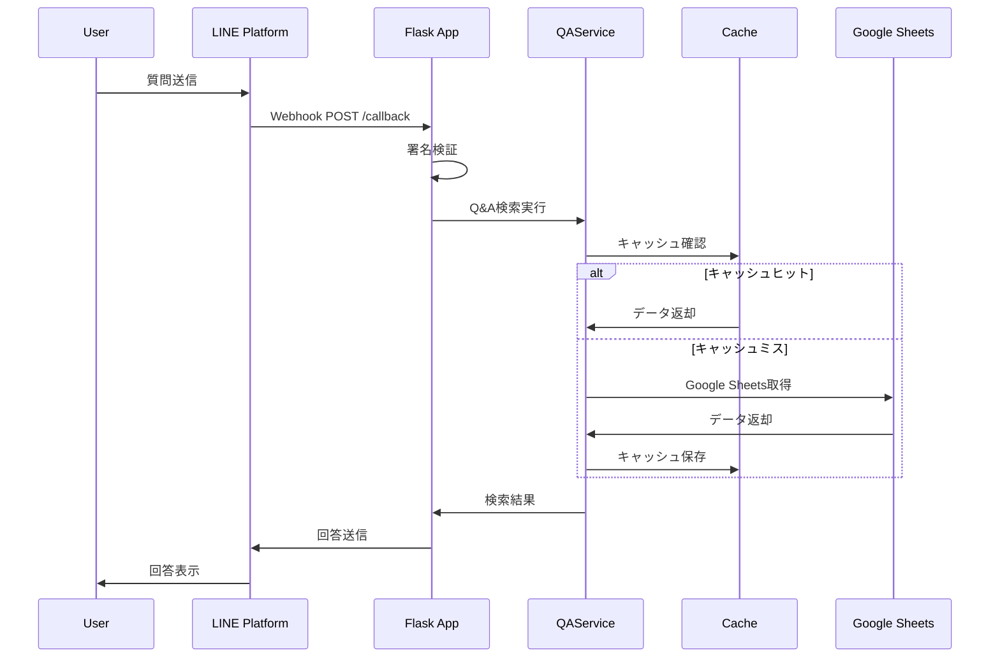
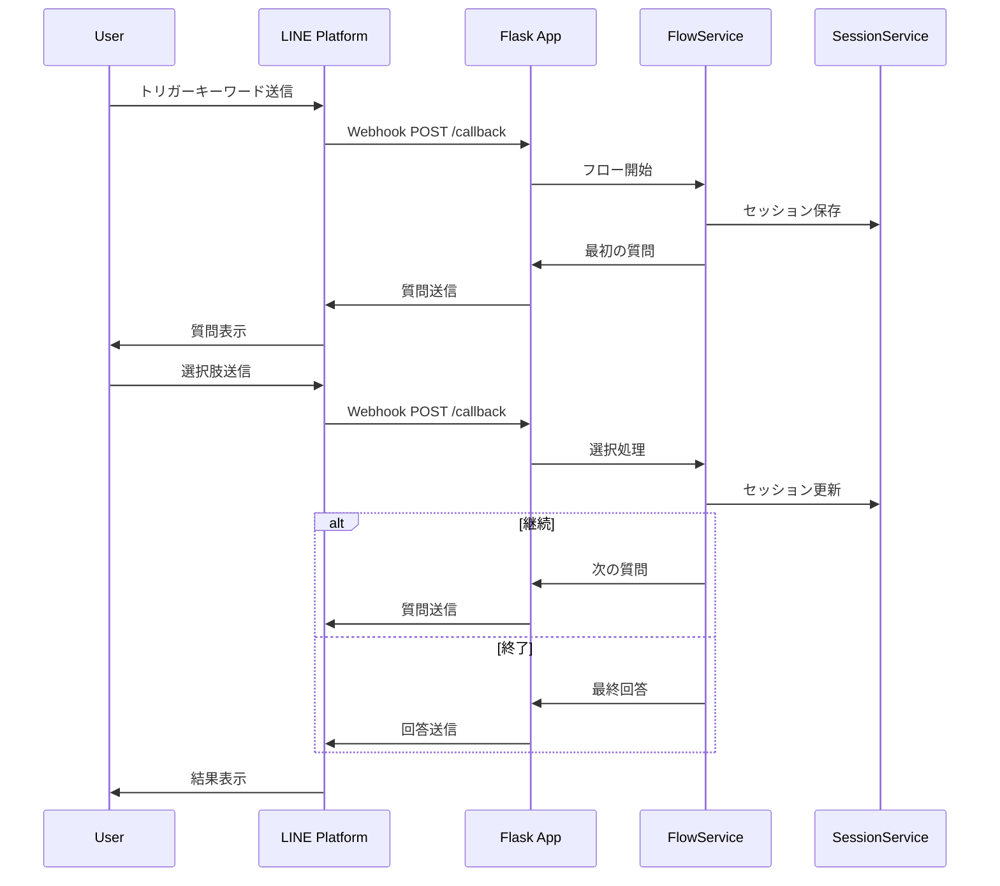

# AIマニュアルBot API仕様書

## 📋 概要

AIマニュアルBotのAPIエンドポイント、リクエスト/レスポンス形式、認証方式を詳細に説明します。

---

## 🔗 ベースURL

```
本番環境: https://your-app.railway.app
開発環境: http://localhost:5000
```

---

## 🔐 認証・認可

### LINE Webhook認証
- **方式**: LINE署名検証
- **ヘッダー**: `X-Line-Signature`
- **検証**: HMAC-SHA256による署名検証

### 管理者認証
- **方式**: カスタムヘッダー認証
- **ヘッダー**: `X-User-ID`
- **対象**: `/admin/*` エンドポイント

---

## 📡 APIエンドポイント

### 1. LINE Webhook

#### `POST /callback`
LINE PlatformからのWebhookを受信し、メッセージを処理します。

**リクエスト**
```http
POST /callback
Content-Type: application/json
X-Line-Signature: {signature}

{
  "events": [
    {
      "type": "message",
      "message": {
        "type": "text",
        "text": "修正回数について教えて"
      },
      "source": {
        "userId": "U1234567890abcdef"
      },
      "replyToken": "reply_token_here"
    }
  ]
}
```

**レスポンス**
```http
HTTP/1.1 200 OK
Content-Type: application/json

{
  "status": "ok"
}
```

**エラーレスポンス**
```http
HTTP/1.1 400 Bad Request
Content-Type: application/json

{
  "error": "Bad Request",
  "message": "署名検証に失敗しました"
}
```

---

### 2. ヘルスチェック

#### `GET /healthz`
システムの健全性を確認します。

**リクエスト**
```http
GET /healthz
```

**レスポンス**
```http
HTTP/1.1 200 OK
Content-Type: application/json

{
  "status": "healthy",
  "timestamp": 1697123456.789,
  "version": "0.1.0"
}
```

**エラーレスポンス**
```http
HTTP/1.1 500 Internal Server Error
Content-Type: application/json

{
  "status": "unhealthy",
  "error": "Google Sheets接続エラー",
  "timestamp": 1697123456.789
}
```

---

### 3. 管理者API

#### `POST /admin/reload`
キャッシュを手動で再読み込みします。

**リクエスト**
```http
POST /admin/reload
X-User-ID: admin_user_id
```

**レスポンス**
```http
HTTP/1.1 200 OK
Content-Type: application/json

{
  "status": "success",
  "message": "キャッシュを再読み込みしました（Q&A + フロー + 資料）",
  "timestamp": 1697123456.789,
  "auto_reload_active": true
}
```

**エラーレスポンス**
```http
HTTP/1.1 500 Internal Server Error
Content-Type: application/json

{
  "status": "error",
  "message": "Google Sheets接続エラー"
}
```

#### `GET /admin/stats`
システムの統計情報を取得します。

**リクエスト**
```http
GET /admin/stats
X-User-ID: admin_user_id
```

**レスポンス**
```http
HTTP/1.1 200 OK
Content-Type: application/json

{
  "total_qa_items": 150,
  "active_qa_items": 142,
  "inactive_qa_items": 8,
  "total_flows": 17,
  "total_locations": 25,
  "total_categories": 5,
  "total_form_logs": 12,
  "pending_form_logs": 3,
  "approved_form_logs": 9,
  "last_updated": "2025-10-13T10:30:00Z",
  "cache_status": "healthy"
}
```

#### `GET /admin/auto-reload/status`
自動リロードの状態を確認します。

**リクエスト**
```http
GET /admin/auto-reload/status
X-User-ID: admin_user_id
```

**レスポンス**
```http
HTTP/1.1 200 OK
Content-Type: application/json

{
  "status": "success",
  "auto_reload_active": true,
  "last_reload": 1697123456.789,
  "next_reload_in_seconds": 300,
  "message": "自動リロードが動作中です"
}
```

---

## 📊 データモデル

### QAItem
```json
{
  "id": 101,
  "question": "修正は何回まで可能ですか？",
  "keywords": "修正,リテイク,回数",
  "synonyms": "変更,やり直し",
  "tags": "制作,品質管理",
  "answer": "修正は最大3回まで可能です。",
  "priority": 3,
  "status": "active",
  "updated_at": "2025-10-13T10:30:00Z"
}
```

### FlowItem
```json
{
  "id": 201,
  "trigger": "月次締め",
  "step": 1,
  "question": "申請は完了していますか？",
  "options": "はい／いいえ",
  "next_step": "2／3",
  "end": false,
  "fallback_next": 999,
  "updated_at": "2025-10-13T10:30:00Z"
}
```

### LocationItem
```json
{
  "category": "経理",
  "title": "月次締め手順書",
  "url": "https://docs.google.com/document/d/...",
  "updated_at": "2025-10-13T10:30:00Z"
}
```

### FormLogItem
```json
{
  "timestamp": "2025-10-13T10:30:00Z",
  "question": "新プランの費用について",
  "answer": "月額5,000円です",
  "category": "営業",
  "keywords": "プラン,費用,料金",
  "approved": false,
  "created_by": "user@example.com",
  "notes": "要確認"
}
```

---

## 🔄 処理フロー

### 1. 通常のQ&A検索フロー



### 2. 分岐会話フロー



---

## 🛡️ セキュリティ

### LINE署名検証
```python
def verify_line_signature(signature: str, body: bytes, channel_secret: str) -> bool:
    """LINE署名の検証"""
    hash_value = hmac.new(
        channel_secret.encode('utf-8'),
        body,
        hashlib.sha256
    ).digest()
    expected_signature = base64.b64encode(hash_value).decode('utf-8')
    return hmac.compare_digest(signature, expected_signature)
```

### 管理者認証
```python
def require_admin(f):
    """管理者認証デコレータ"""
    @wraps(f)
    def decorated_function(*args, **kwargs):
        user_id = request.headers.get('X-User-ID')
        if not user_id or user_id not in app.config['ADMIN_USER_IDS']:
            abort(403, description="管理者権限が必要です")
        return f(*args, **kwargs)
    return decorated_function
```

---

## 📈 パフォーマンス

### レスポンス時間目標
- **Q&A検索**: 500ms以内
- **分岐会話**: 200ms以内
- **キャッシュ取得**: 50ms以内
- **全体応答**: 2秒以内

### スループット
- **同時接続**: 100ユーザー
- **リクエスト処理**: 1000リクエスト/分
- **メモリ使用量**: 512MB以内

---

## 🔧 エラーハンドリング

### HTTPステータスコード
- **200**: 成功
- **400**: リクエストエラー（署名検証失敗など）
- **403**: 認証エラー（管理者権限不足）
- **500**: サーバーエラー（内部エラー）

### エラーレスポンス形式
```json
{
  "error": "Error Type",
  "message": "エラーの詳細説明",
  "timestamp": 1697123456.789
}
```

### ログ出力
```json
{
  "timestamp": "2025-10-13T10:30:00Z",
  "level": "ERROR",
  "service": "line_qa_bot",
  "user_id": "hash_user_id",
  "event_type": "api_error",
  "error": "Google Sheets接続エラー",
  "request_id": "req_123456789"
}
```

---

## 🧪 テスト

### 単体テスト
```bash
# テスト実行
poetry run pytest tests/

# カバレッジ付きテスト
poetry run pytest --cov=line_qa_system tests/
```

### 統合テスト
```bash
# ヘルスチェック
curl -X GET https://your-app.railway.app/healthz

# 管理者APIテスト
curl -X POST https://your-app.railway.app/admin/reload \
  -H "X-User-ID: admin_user_id"

# 統計情報取得
curl -X GET https://your-app.railway.app/admin/stats \
  -H "X-User-ID: admin_user_id"
```

### 負荷テスト
```bash
# Apache Benchを使用した負荷テスト
ab -n 1000 -c 10 https://your-app.railway.app/healthz
```

---

## 📝 変更履歴

| 日付 | バージョン | 変更内容 | 担当者 |
|------|-----------|----------|--------|
| 2025/10/13 | 1.0 | 初版作成 | AI Assistant |
| - | - | STEP1完了 | - |
| - | - | STEP2完了 | - |
| - | - | STEP3実装中 | - |

---

## 📞 関連ドキュメント

- **要件定義書**: `docs/REQUIREMENTS.md`
- **システム構成書**: `docs/SYSTEM_ARCHITECTURE.md`
- **デプロイメントガイド**: `docs/DEPLOYMENT_GUIDE.md`
- **各ステップ別ガイド**: `docs/STEP*_*.md`
